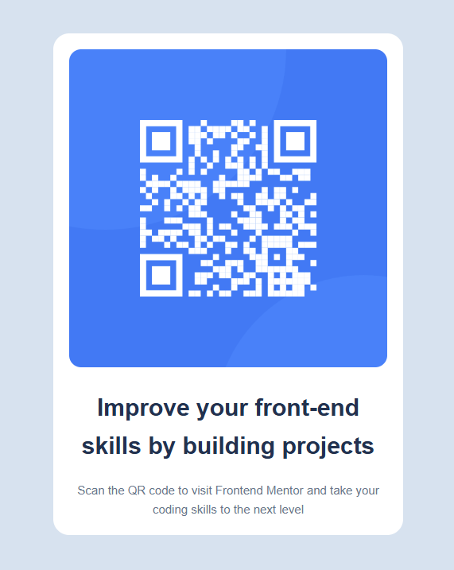

# Frontend Mentor - QR code component solution

This is a solution to the [QR code component challenge on Frontend Mentor](https://www.frontendmentor.io/challenges/qr-code-component-iux_sIO_H). Frontend Mentor challenges help you improve your coding skills by building realistic projects. 

## ## Table of contents

- [Frontend Mentor - QR code component solution](#frontend-mentor---qr-code-compon-solution)
  - [Table of contents](#table-of-contents)
  - [Overview](#overview)
    - [The challenge](#the-challenge)
    - [Screenshot](#screenshot)
    - [Links](#links)
  - [My process](#my-process)
    - [Built with](#built-with)
  - [Author](#author)
  - [Acknowledgments](#acknowledgments)**

## Overview

### Screenshot

### Links

- Live Site URL: [https://v-qr-code-component.netlify.app](https://v-qr-code-component.netlify.app)
- Solution URL: [https://github.com/vVvOvOvVv/qr-code-component](https://github.com/vVvOvOvVv/qr-code-component)

## My process

### Built with

- [Vue.js](https://vuejs.org) (Options API)
- [npm](https://www.npmjs.com)
- HTML
## Author

- Dev Portfolio & Website - [V's Portfolio](https://vvvovovvv.github.io)](https://www.twitter.com/yourusername)

## Acknowledgments

Resources and assets used in this project were provided by [Frontend Mentor](https://www.frontendmentor.io/challenges/browser-extension-manager-ui-yNZnOfsMAp). This is otherwise a solo project.
